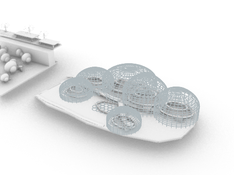

# Rhino MCP Share Kit



A shareable Windows + Rhino 8 starter kit for running Rhino as a local MCP server and connecting it to both Codex and Claude.

This repo packages the working setup from our Rhino MCP session into a cleaner structure you can:

- publish to GitHub
- zip and send to friends
- reuse on another machine

## What This Includes

- Rhino MCP source code
- a ready-to-copy Rhino package build
- a Codex local marketplace plugin
- a Claude local marketplace plugin and Rhino skill
- portable setup scripts
- Rhino model-builder scripts created during the session
- preview images and viewport captures
- a small demo `.3dm` file

## Repo Layout

```text
rhino-mcp-share-kit/
|-- .mcp.json
|-- .claude/settings.json
|-- codex-marketplace/
|-- claude-marketplace/
|-- rhino-package/
|-- rhino-plugin-source/
|-- scripts/
|-- examples/
|-- notes/
`-- README.md
```

## Quick Start

### 1. Install the Rhino package

Copy:

`rhino-package/Rhino-MCP-Platform/0.0.1`

to:

`%APPDATA%\McNeel\Rhinoceros\packages\8.0\Rhino-MCP-Platform\0.0.1`

If that folder already exists, back it up first.

### 2. Install for Codex

Run:

```powershell
powershell -ExecutionPolicy Bypass -File .\scripts\install_codex_rhino_marketplace.ps1
```

### 3. Install for Claude

Run:

```powershell
powershell -ExecutionPolicy Bypass -File .\scripts\install_claude_rhino_marketplace.ps1
```

### 4. Start Rhino MCP

Open Rhino 8 and run:

`RhinoMCP`

Or run the portable loader from Rhino:

```text
-RunPythonScript (<full-path-to-this-folder>\scripts\load_rhino_mcp_portable.py)
```

If it starts cleanly, Rhino should report:

`http://localhost:4862/`

### 5. Try a prompt

- `Create a 10 x 10 x 10 box at the origin in Rhino.`
- `List all objects in the current Rhino file.`
- `Capture a viewport image from Rhino.`
- `Run this Rhino command: _Line 0,0,0 10,0,0`

## Claude Support

This repo includes both:

- a project-level `.mcp.json`
- a Claude marketplace plugin with a Rhino-focused skill

So someone can either:

1. open the repo directly in Claude, or
2. install the bundled Claude marketplace plugin globally

Claude CLI command if manual setup is preferred:

```bash
claude mcp add --transport http rhino http://localhost:4862
```

## Included Demo Assets

- Demo Rhino file: [examples/demo-files/rhino_mcp_demo_scene.3dm](examples/demo-files/rhino_mcp_demo_scene.3dm)
- Builder scripts: [scripts/README.md](scripts/README.md)
- Preview images: [examples/previews](examples/previews)
- Viewport shots: [examples/rhino-selection-shots](examples/rhino-selection-shots)

## Most Useful Files

- Codex installer: [scripts/install_codex_rhino_marketplace.ps1](scripts/install_codex_rhino_marketplace.ps1)
- Claude installer: [scripts/install_claude_rhino_marketplace.ps1](scripts/install_claude_rhino_marketplace.ps1)
- Rhino loader: [scripts/load_rhino_mcp_portable.py](scripts/load_rhino_mcp_portable.py)
- Claude Rhino skill: [claude-marketplace/rhino-local/skills/rhino-mcp/SKILL.md](claude-marketplace/rhino-local/skills/rhino-mcp/SKILL.md)

## Notes

- The Rhino MCP endpoint is an API endpoint, not a normal web page.
- Rhino must stay open while Codex or Claude uses the `rhino` MCP server.
- The large full session file is intentionally not included in this GitHub-friendly bundle.

More detail:

- [notes/LARGE_ASSETS_NOT_INCLUDED.md](notes/LARGE_ASSETS_NOT_INCLUDED.md)

## Publish Tips

1. Put this folder in its own GitHub repo.
2. Keep the preview image in the README for a better landing page.
3. If you want to share larger `.3dm` files, use Git LFS or a cloud link.
4. Test both Codex and Claude once after cloning on a second machine.
